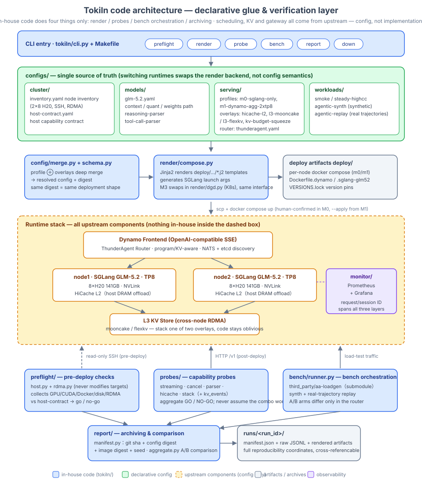

# Tokiln

Turn 2×8 H20 (141GB) into a deployable, callable, observable, load-testable GLM-5.2 token service.
Stack: NVIDIA Dynamo + SGLang + ThunderAgent router + HiCache (L2 host offload; L3 mooncake/flexkv switchable).

- Design doc: [docs/design/tokiln-code-structure.md](docs/design/tokiln-code-structure.md)
- Architecture diagram: [docs/design/tokiln-architecture.svg](docs/design/tokiln-architecture.svg)


- Load generator: [third_party/aa-loadgen](https://github.com/davilu-nvidia/aa-loadgen) (submodule; synth + real-trajectory replay)
- Milestones: M0 single-node pure SGLang → M1 Dynamo+TA two-node A/B → M2 HiCache L2→L3 → M3 Kubernetes

```bash
make install
make preflight            # read-only SSH checks across enabled nodes
make m0-render            # declarative config → compose (with config digest)
make probe                # streaming/cancel/parser/hicache/stack five-probe Go/No-Go
make smoke && make bench-ab
make monitor-serve        # :8100 — then `tokiln monitor watch` from any terminal (win/mac/linux)
```

Principle: in-house code does exactly four things — render / probe / bench orchestration / archiving.
Scheduling, KV, and the gateway all come from upstream; we write config, not implementations.
Every run archives `runs/<run_id>/manifest.json` (git sha + config digest + image digest + seed) for reproducibility.

**Status**: M0 passed end-to-end on h20-09 (2026-07-28, see [docs/exp](docs/exp/2026-07-28-m0-h20-09.md)).
Remaining `TODO(spike NN)` markers await the ta-repro archaeology and the four compatibility spikes.
